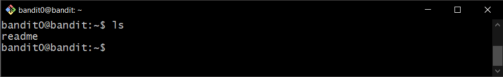
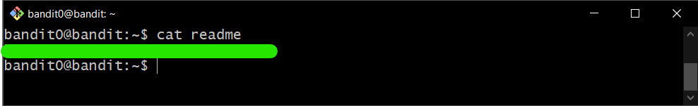

# Bandit Level 0

## Goal

The password for the next level is stored in a file called **readme** located in the home directory. Use this password to log into bandit1 using SSH. Whenever you find a password for a level, use SSH (on port 2220) to log into that level and continue the game.

## My solution

Connect to the server using ssh:

```
ssh bandit0@{hostname} -p {port}
```

Password is **bandit0**, then we get:

---

```
      ,----..            ,----,          .---.
     /   /   \         ,/   .`|         /. ./|
    /   .     :      ,`   .'  :     .--'.  ' ;
   .   /   ;.  \   ;    ;     /    /__./ \ : |
  .   ;   /  ` ; .'___,/    ,' .--'.  '   \' .
  ;   |  ; \ ; | |    :     | /___/ \ |    ' '
  |   :  | ; | ' ;    |.';  ; ;   \  \;      :
  .   |  ' ' ' : `----'  |  |  \   ;  `      |
  '   ;  \; /  |     '   :  ;   .   \    .\  ;
   \   \  ',  /      |   |  '    \   \   ' \ |
    ;   :    /       '   :  |     :   '  |--"
     \   \ .'        ;   |.'       \   \ ;
  www. `---` ver     '---' he       '---" ire.org
```

Welcome to OverTheWire!

If you find any problems, please report them to Steven or morla on
irc.overthewire.org.

--[ Playing the games ]--

This machine might hold several wargames.
If you are playing "somegame", then:

    * USERNAMES are somegame0, somegame1, ...
    * Most LEVELS are stored in /somegame/.
    * PASSWORDS for each level are stored in /etc/somegame_pass/.

Write-access to homedirectories is disabled. It is advised to create a
working directory with a hard-to-guess name in /tmp/. You can use the
command "mktemp -d" in order to generate a random and hard to guess
directory in /tmp/. Read-access to both /tmp/ and /proc/ is disabled
so that users can not snoop on eachother. Files and directories with
easily guessable or short names will be periodically deleted!

Please play nice:

    * don't leave orphan processes running
    * don't leave exploit-files laying around
    * don't annoy other players
    * don't post passwords or spoilers
    * again, DONT POST SPOILERS!
      This includes writeups of your solution on your blog or website!

--[ Tips ]--

This machine has a 64bit processor and many security-features enabled
by default, although ASLR has been switched off. The following
compiler flags might be interesting:

    -m32                    compile for 32bit
    -fno-stack-protector    disable ProPolice
    -Wl,-z,norelro          disable relro

In addition, the execstack tool can be used to flag the stack as
executable on ELF binaries.

Finally, network-access is limited for most levels by a local
firewall.

--[ Tools ]--

For your convenience we have installed a few usefull tools which you can find
in the following locations:

    * gef (https://github.com/hugsy/gef) in /usr/local/gef/
    * pwndbg (https://github.com/pwndbg/pwndbg) in /usr/local/pwndbg/
    * peda (https://github.com/longld/peda.git) in /usr/local/peda/
    * gdbinit (https://github.com/gdbinit/Gdbinit) in /usr/local/gdbinit/
    * pwntools (https://github.com/Gallopsled/pwntools)
    * radare2 (http://www.radare.org/)
    * checksec.sh (http://www.trapkit.de/tools/checksec.html) in /usr/local/bin/checksec.sh

--[ More information ]--

For more information regarding individual wargames, visit
http://www.overthewire.org/wargames/

For support, questions or comments, contact us through IRC on
irc.overthewire.org #wargames.

Enjoy your stay!

---

List files in this directory:

```
ls
```

<div>
    
</div>

See contents in the file:

```
cat {filename}
```

Then you will get **password** for bandit1

<div>
    
</div>
