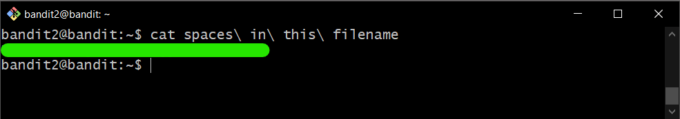

# Bandit Level 2

## Goal

The password for the next level is stored in a file called spaces in this filename located in the home directory.

## My solution

Connect to the server using ssh:

```
ssh bandit2@{hostname} -p {port}
```

---

See contents in the file called spaces in filename by adding `\` before special characters, for example:

```
cat spaces\ in\ this\ file
```

Then you get **password** for bandit3

<div>
    
</div>
