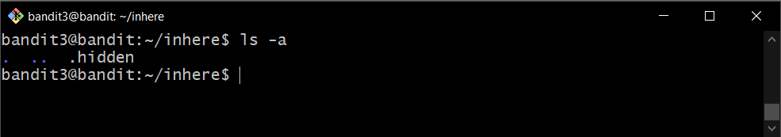
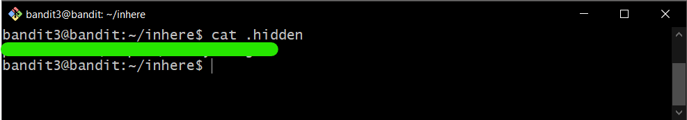

# Bandit Level 3

## Goal

The password for the next level is stored in a hidden file in the inhere directory.

## My solution

Connect to the server using ssh:

```
ssh bandit3@{hostname} -p {port}
```

---

Change directory by using `cd`:

```
cd {dirname}
```

List directory contents by using `ls` with `-a` to show entries starting with `.`:

```
ls -a
```

You can see the hidden file following by `.`.

<div>
    
</div>

Then you get **password** for bandit3 by using `cat` command.

<div>
    
</div>
