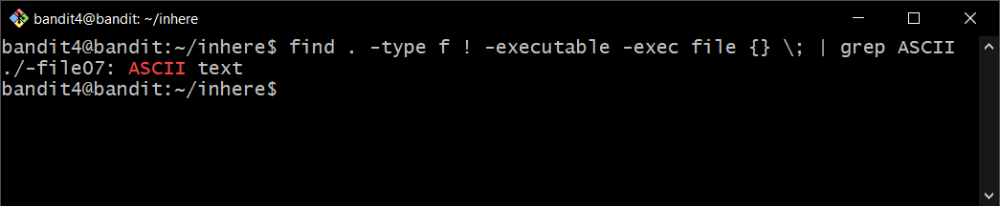
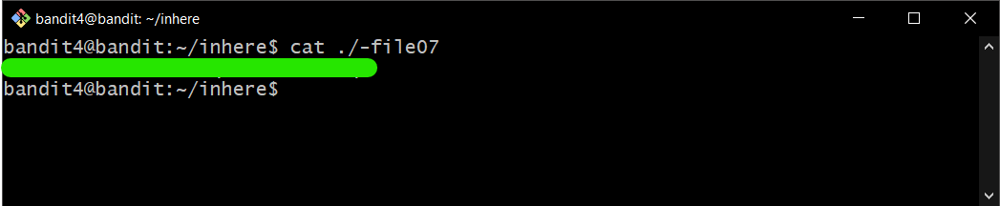

# Bandit Level 4

## Goal

The password for the next level is stored in the only human-readable file in the inhere directory. Tip: if your terminal is messed up, try the “reset” command.

## My solution

Connect to the server using ssh:

```
ssh bandit4@{hostname} -p {port}
```

---

Change directory by using `cd`:

```
cd {dirname}
```

Use `find` command to search for files in a directory hierarchy:

```
find . -type f ! -executable -exec file {} \; | grep ASCII
```

- `-type f` = File is of type regular file.
- `! -executable` = Search for files which are not executable.
- `-exec {command}` = Execute command.
- `file {}` = Determine file type, `{}` is replaced by the output from `find` command.
- `grep ASCII` = Print output only files that contain ASCII text.

The output is shown below.

<div>
    
</div>

Then you get **password** for bandit5 by using `cat` command.

<div>
    
</div>
