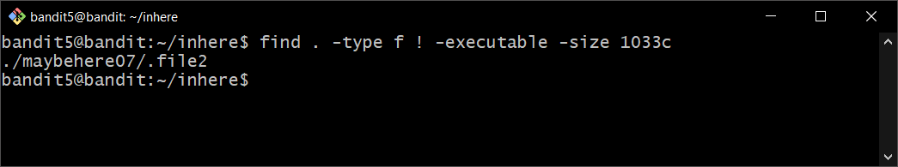
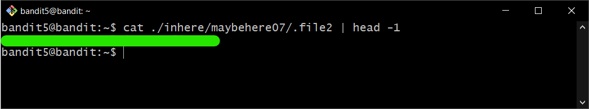

# Bandit Level 5

## Goal

The password for the next level is stored in a file somewhere under the inhere directory and has all of the following properties:

- human-readable
- 1033 bytes in size
- not executable

## My solution

Connect to the server using ssh:

```
ssh bandit5@{hostname} -p {port}
```

---

Change directory by using `cd`:

```
cd {dirname}
```

Use `find` command to search for files in a directory hierarchy:

```
find . -type f ! -executable -size 1033c
```

- `.` = Current directory.
- `-type f` = File is of type regular file.
- `! -executable` = Search for files which are not executable.
- `-exec {command}` = Execute command.
- `file {}` = Determine file type, `{}` is replaced by the output from `find` command.
- `grep ASCII` = Print output only files that contain ASCII text.

The output is shown below.

<div>
    
</div>

Then you get **password** for bandit6 by using `cat` command:

<div>
    
</div>

- `head -1` = get the first line from the file
