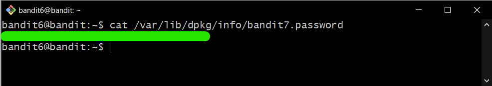

# Bandit Level 6

## Goal

The password for the next level is stored **somewhere on the server** and has all of the following properties:

- owned by user bandit7
- owned by group bandit6
- 33 bytes in size

## My solution

Connect to the server using ssh:

```
ssh bandit6@{hostname} -p {port}
```

---

Use `find` command to search for files in a directory hierarchy:

```
find / -size 33c -group bandit6 -user bandit7 2>/dev/null
```

- `/` = Root directory.
- `-size 33c` = Size of file is 33 bytes.
- `-group bandit6` = File is owned by group bandit6.
- `-user bandit7` = File is owned by bandit7.
- `2>/dev/null` = Throw error from the output (stderr).

The output is shown below.

<div>
    
</div>

Then you get **password** for bandit7 by using `cat` command:

<div>
    
</div>
