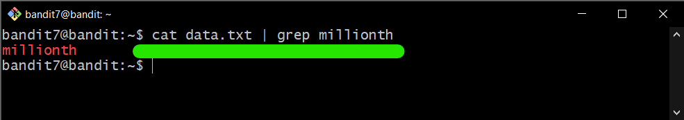

# Bandit Level 7

## Goal

The password for the next level is stored in the file **data.txt** next to the word **millionth**

## My solution

Connect to the server using ssh:

```
ssh bandit7@{hostname} -p {port}
```

---

Use `cat` command to see contents in the file and use `grep` to print lines that match patterns:

```
cat {filename} | grep {pattern}
```

Then, the **password** for bandit8 is shown below.

<div>
    
</div>
