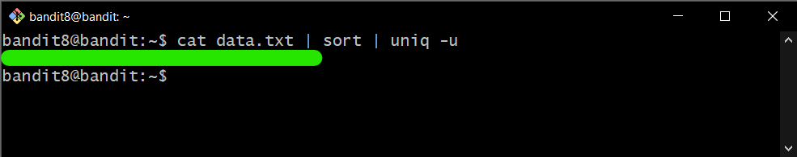

# Bandit Level 8

## Goal

The password for the next level is stored in the file **data.txt** and is the only line of text that occurs only once.

## My solution

Connect to the server using ssh:

```
ssh bandit8@{hostname} -p {port}
```

---

Use command below to print the **password** for bandit9:

```
cat {filename} | sort | uniq -u
```

- `cat` = print contents on the standard output
- `sort` = sort lines of text files
- `uniq -u` = only print unique lines

<div>
    
</div>
