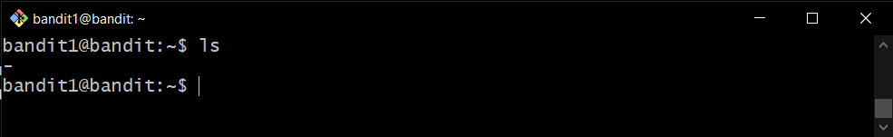
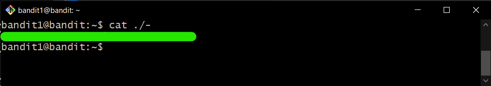

# Bandit Level 1

## Goal

The password for the next level is stored in a file called - located in the home directory.

## My solution

Connect to the server using ssh:

```
ssh bandit1@{hostname} -p {port}
```

---

List files in the current directory:

```
ls
```

<div align=center>
    
</div>

See contents in the file of current directory by adding "./" before filename:

```
cat ./{filename}
```

Then you get **password** for bandit2

<div align=center>
    
</div>
